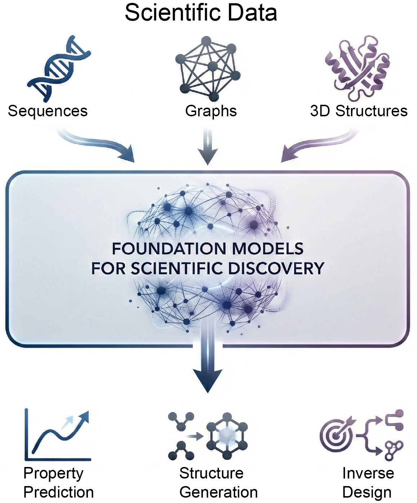

# 🔬 Foundation Models for Scientific Discovery

[](https://opensource.org/licenses/MIT)
[](http://makeapullrequest.com)


<strong>🚧 Continuously updated~~~</strong>  
📅 Last updated: January, 2026 

 <p align="center">
  
</p>
<p align="center"><b>📌 Fig. 1.</b> Foundation models for scientific discovery.</p>

A comprehensive and up-to-date collection of **Foundation Models for Scientific Discovery**, covering proteins, molecules, genomics, materials, and multi-modal scientific AI.

This repository accompanies our survey paper:

> **Foundation Models for Scientific Discovery: A Survey of Modalities, Architectures, and Strategies**  
> *Pinlong Zhao*  
> School of Cyberspace, Hangzhou Dianzi University  
> [[Paper]](#citation)

---

## 📋 Table of Contents

- [Overview](#-overview)
- [Taxonomy](#-taxonomy)
- [Models by Data Modality](#-models-by-data-modality)
  - [Sequence-based Models](#1-sequence-based-models)
  - [Graph-based Models](#2-graph-based-models)
  - [3D Structure-based Models](#3-3d-structure-based-models)
  - [Multi-modal Models](#4-multi-modal-models)
- [Pre-training Paradigms](#-pre-training-paradigms)
- [Benchmarks & Datasets](#-benchmarks--datasets)
- [Citation](#-citation)
- [Contributing](#-contributing)
- [Contact](#-contact)

---

## 🌟 Overview

The integration of artificial intelligence with scientific discovery has entered a transformative era with the emergence of **foundation models**. These large-scale pre-trained models, characterized by their ability to transfer knowledge across diverse tasks and domains, are revolutionizing how we approach scientific problems in physics, chemistry, biology, and materials science.

### Key Features of This Repository

- 📚 **Comprehensive Coverage**: Extensive collection of foundation models across 4 data modalities
- 🏷️ **Systematic Taxonomy**: Organized by modality, architecture, and pre-training paradigm
- 🔗 **Direct Links**: Paper and code links for all models
- 🔄 **Regular Updates**: Continuously updated with the latest research

---

## 🗂️ Taxonomy


We organize scientific foundation models along **three orthogonal dimensions**:

| Dimension | Categories |
|-----------|------------|
| **Data Modality** | Sequence, Graph, 3D Structure, Multi-modal |
| **Model Architecture** | Transformer, GNN, Equivariant Networks, Hybrid |
| **Pre-training Paradigm** | Masked, Contrastive, Autoregressive, Diffusion, Denoising, Supervised |

---

## 📊 Models by Data Modality

### 1. Sequence-based Models

Sequence-based foundation models treat scientific entities as linear token sequences, enabling direct application of language modeling techniques.

#### 🧬 Protein Language Models

| Model | Paper | Code | Architecture | Pre-training | Description |
|-------|-------|------|--------------|--------------|-------------|
| **ESM-1b** | [PNAS 2021](https://www.pnas.org/doi/abs/10.1073/pnas.2016239118) | [GitHub](https://github.com/facebookresearch/esm) | Transformer | Masked | Evolutionary scale modeling for protein function prediction |
| **ProtGPT2** | [Nat. Commun. 2022](https://www.nature.com/articles/s41467-022-32007-7) | [HuggingFace](https://huggingface.co/docs/transformers/main_classes/trainer) | Transformer | Autoregressive | De novo protein generation in zero-shot manner |
| **ESM-2** | [Science 2023](https://www.science.org/doi/abs/10.1126/science.ade2574) | [GitHub](https://github.com/facebookresearch/esm) | Transformer | Masked | 15B parameters, SOTA on structure & function prediction |
| **ProGen2** | [Cell Systems 2023](https://www.cell.com/cell-systems/fulltext/S2405-4712(23)00272-7) | [Zenodo](https://zenodo.org/records/8078725) | Transformer | Autoregressive | Generates functional protein sequences |
| **SaProt** | [ICLR 2024](https://openreview.net/forum?id=6MRm3G4NiU) | [GitHub](https://github.com/westlake-repl/SaProt) | Transformer | Masked | Structure-aware protein language model |
| **ESM-3** | [Science 2024](https://www.science.org/doi/abs/10.1126/science.ads0018) | [GitHub](https://github.com/evolutionaryscale/esm) | Transformer | Masked+AR | 98B params, generated novel GFP (esmGFP) |
| **xTrimoPGLM** | [Nat. Methods 2025](https://www.nature.com/articles/s41592-025-02636-z) | [HuggingFace](https://huggingface.co/proteinglm/) | Transformer | Masked+AR | Unified protein understanding & design |

#### 🧫 Genomic Language Models

| Model | Paper | Code | Architecture | Pre-training | Description |
|-------|-------|------|--------------|--------------|-------------|
| **DNABERT** | [Bioinformatics 2021](https://academic.oup.com/bioinformatics/article-abstract/37/15/2112/6128680) | [GitHub](https://github.com/jerryji1993/DNABERT) | Transformer | Masked | Pioneering BERT for genomics with k-mer tokenization |
| **Nucleotide Transformer** | [Nat. Methods 2024](https://www.nature.com/articles/s41592-024-02523-z) | [GitHub](https://github.com/instadeepai/nucleotide-transformer) | Transformer | Masked | 2.5B params, 3,200 genomes, strong zero-shot |
| **DNABERT-2** | [ICLR 2024](https://openreview.net/forum?id=oMLQB4EZE1) | [GitHub](https://github.com/MAGICS-LAB/DNABERT_2) | Transformer | Masked | BPE tokenization, 28 datasets, multi-species |
| **Evo** | [Science 2024](https://www.science.org/doi/abs/10.1126/science.ado9336) | [GitHub](https://github.com/evo-design/evo) | Transformer | Autoregressive | Long-context genomic foundation model |
| **LucaOne** | [Nat. Mach. Intell. 2025](https://www.nature.com/articles/s42256-025-01044-4) | [GitHub](https://github.com/LucaOne/LucaOne) | Transformer | Masked | Unified DNA/RNA/Protein foundation model |

#### 💊 Chemical Language Models

| Model | Paper | Code | Architecture | Pre-training | Description |
|-------|-------|------|--------------|--------------|-------------|
| **ChemBERTa** | [arXiv 2020](https://arxiv.org/pdf/2010.09885) | [GitHub](https://github.com/seyonechithrananda/bert-loves-chemistry) | Transformer | Masked | RoBERTa pre-training on 77M SMILES |
| **MoLFormer** | [Nat. Mach. Intell. 2022](https://www.nature.com/articles/s42256-022-00580-7) | [GitHub](https://github.com/IBM/molformer) | Transformer | Masked | 1.1B molecules, attention captures 3D info |

---

### 2. Graph-based Models

Graph neural networks explicitly model molecular topology, capturing bonding patterns and interaction networks.

| Model | Paper | Code | Architecture | Pre-training | Description |
|-------|-------|------|--------------|--------------|-------------|
| **GROVER** | [NeurIPS 2020](https://proceedings.neurips.cc/paper/2020/hash/94aef38441efa3380a3bed3faf1f9d5d-Abstract.html) | [GitHub](https://github.com/tencent-ailab/grover) | GNN+Trans | Masked+Contrastive | Message passing + self-attention, 10M molecules |
| **MolCLR** | [Nat. Mach. Intell. 2022](https://www.nature.com/articles/s42256-022-00447-x) | [GitHub](https://github.com/yuyangw/MolCLR) | GNN | Contrastive | Contrastive learning with graph augmentations |
| **GraphMVP** | [ICLR 2022](https://openreview.net/forum?id=xQUe1pOKPam) | [GitHub](https://github.com/chao1224/GraphMVP) | GNN | Contrastive+Gen | Multi-view 2D/3D pre-training |
| **GEM** | [Nat. Mach. Intell. 2022](https://www.nature.com/articles/s42256-021-00438-4) | [GitHub](https://github.com/PaddlePaddle/PaddleHelix/tree/dev/apps/pretrained_compound/ChemRL/GEM) | GNN | Supervised | Geometry-enhanced molecular representation |
| **Mole-BERT** | [ICLR 2023](https://openreview.net/forum?id=jevY-DtiZTR) | [GitHub](https://github.com/junxia97/Mole-BERT) | GNN+Trans | Masked | Context-aware tokenization via VQ |
| **PHGL-DDI** | [Expert Syst. Appl. 2025](https://www.sciencedirect.com/science/article/pii/S0957417425000302) | -- | GNN | Supervised | Drug-drug interaction prediction |
| **SCAGE** | [Nat. Commun. 2025](https://www.nature.com/articles/s41467-025-59634-0) | [GitHub](https://github.com/KazeDog/scage) | GNN+Trans | Supervised | Self-supervised molecular property prediction |

---

### 3. 3D Structure-based Models

Three-dimensional structural information is critical for understanding molecular function, as properties like binding affinity and catalytic activity depend on precise spatial arrangements.

#### 🔬 Protein Structure Models

| Model | Paper | Code | Architecture | Pre-training | Description |
|-------|-------|------|--------------|--------------|-------------|
| **AlphaFold 2** | [Nature 2021](https://www.nature.com/articles/s41586-021-03819-2) | [GitHub](https://github.com/deepmind/alphafold) | Equi+Trans | Supervised | Revolutionary protein structure prediction |
| **RFdiffusion** | [Nature 2023](https://www.nature.com/articles/s41586-023-06415-8) | [GitHub](https://github.com/RosettaCommons/RFdiffusion) | Equi+GNN | Diffusion | De novo protein backbone design |
| **AlphaFold 3** | [Nature 2024](https://www.nature.com/articles/s41586-024-07487-w) | [Server](https://alphafoldserver.com/) | Equi+Trans | Supervised | Biomolecular complex structure prediction |
| **RoseTTAFold AA** | [Science 2024](https://www.science.org/doi/full/10.1126/science.adl2528) | [GitHub](https://github.com/baker-laboratory/RoseTTAFold-All-Atom) | Equi+Trans | Supervised | Generalized biomolecular structure prediction |
| **Boltz-1** | [bioRxiv 2024](https://pmc.ncbi.nlm.nih.gov/articles/PMC11601547/) | [GitHub](https://github.com/jwohlwend/boltz) | Equi+Trans | Supervised+Diffusion | Open-source biomolecular structure prediction |
| **Boltz-2** | [bioRxiv 2025](https://pmc.ncbi.nlm.nih.gov/articles/PMC12262699/) | [GitHub](https://github.com/jwohlwend/boltz) | Equi+Trans | Supervised+Diffusion | Structure + binding affinity prediction |

#### 💊 Molecular 3D Models

| Model | Paper | Code | Architecture | Pre-training | Description |
|-------|-------|------|--------------|--------------|-------------|
| **PaiNN** | [ICML 2021](https://proceedings.mlr.press/v139/schutt21a.html) | -- | Equi+GNN | Supervised | Equivariant message passing for molecules |
| **Uni-Mol** | [ChemRxiv 2023](https://chemrxiv.org/engage/chemrxiv/article-details/6402990d37e01856dc1d1581) | [GitHub](https://github.com/deepmodeling/Uni-Mol) | Transformer | Denoising | 3D coordinate denoising, 209M conformations |
| **DiffDock** | [ICLR 2023](https://openreview.net/forum?id=kKF8_K-mBbS) | [GitHub](https://github.com/gcorso/DiffDock) | Equi+GNN | Diffusion | Diffusion-based molecular docking |
| **Uni-Mol2** | [NeurIPS 2024](https://arxiv.org/abs/2406.14969) | [GitHub](https://github.com/deepmodeling/Uni-Mol) | Transformer | Denoising | 1.1B params, dual-track architecture |
| **Uni-Mol3** | [arXiv 2025](https://arxiv.org/abs/2508.00920) | [GitHub](https://github.com/LirongWu/Uni-Mol3) | Transformer | Denoising | Chemical reaction modeling |

#### ⚛️ Materials Structure Models (MLIPs)

| Model | Paper | Code | Architecture | Pre-training | Description |
|-------|-------|------|--------------|--------------|-------------|
| **MACE** | [NeurIPS 2022](https://proceedings.neurips.cc/paper_files/paper/2022/hash/4a36c3c51af11ed9f34615b81edb5bbc-Abstract-Conference.html) | [GitHub](https://github.com/ACEsuit/mace) | Equi+GNN | Supervised | Higher-order equivariant message passing |
| **CHGNet** | [Nat. Mach. Intell. 2023](https://www.nature.com/articles/s42256-023-00716-3) | [GitHub](https://github.com/CederGroupHub/chgnet) | GNN | Supervised | Charge-informed dynamics, 1.5M structures |
| **GNoME** | [Nature 2023](https://www.nature.com/articles/s41586-023-06735-9) | [GitHub](https://github.com/google-deepmind/materials_discovery) | GNN | Supervised | Discovered 2.2M new stable materials |
| **MACE-MP-0** | [arXiv 2024](https://arxiv.org/abs/2401.00096) | [GitHub](https://github.com/ACEsuit/mace/) | Equi+GNN | Supervised | Universal foundation model for materials |
| **SevenNet** | [JCTC 2024](https://pubs.acs.org/doi/abs/10.1021/acs.jctc.4c00190) | [GitHub](https://github.com/MDIL-SNU/SevenNet) | Equi+GNN | Supervised | Scalable equivariant MLIP |
| **PET-MAD** | [Nat. Commun. 2025](https://www.nature.com/articles/s41467-025-65662-7) | [GitHub](https://github.com/lab-cosmo/upet) | Equi+GNN | Supervised | Universal pre-trained MLIP |
| **Pol-MLIP** | [Nat. Commun. 2025](https://www.nature.com/articles/s41467-025-65496-3) | [GitHub](https://github.com/reaxnet/reaxnet) | Equi+GNN | Supervised | Long-range interactions for materials |

---

### 4. Multi-modal Models

Multi-modal models integrate diverse data types, leveraging complementary information from sequences, structures, and natural language.

| Model | Paper | Code | Architecture | Pre-training | Description |
|-------|-------|------|--------------|--------------|-------------|
| **MolT5** | [EMNLP 2022](https://aclanthology.org/2022.emnlp-main.26/) | [GitHub](https://github.com/blender-nlp/MolT5) | Transformer | Autoregressive | Molecule-text translation (SMILES ↔ NL) |
| **MoleculeSTM** | [Nat. Mach. Intell. 2023](https://www.nature.com/articles/s42256-023-00759-6) | [GitHub](https://github.com/chao1224/MoleculeSTM/tree/main) | GNN+Trans | Contrastive | Text-guided molecule retrieval & editing |
| **MolCA** | [EMNLP 2023](https://aclanthology.org/2023.emnlp-main.966/) | [GitHub](https://github.com/acharkq/MolCA) | GNN+Trans | Contrastive | Cross-modal projector for molecular QA |
| **GIT-Mol** | [Comput. Biol. Med. 2024](https://www.sciencedirect.com/science/article/pii/S0010482524001574) | [GitHub](https://github.com/AI-HPC-Research-Team/GIT-Mol) | GNN+Trans | Contrastive | Graph + Image + Text multi-modal |
| **MatterGen** | [arXiv 2024](https://arxiv.org/abs/2312.03687) | -- | Equi-GNN | Supervised+Diffusion | Property-conditioned materials generation |
| **RETINA** | [PLoS Comput. Biol. 2025](https://journals.plos.org/ploscompbiol/article?id=10.1371/journal.pcbi.1013115) | [GitHub](https://github.com/BaderLab/RETINA) | CNN+Trans | Diffusion | Electron microscopy image analysis |

---

## 🎯 Pre-training Paradigms

| Paradigm | Description | Representative Models |
|----------|-------------|----------------------|
| **Masked Modeling** | Predict randomly masked tokens/atoms from context | ESM-2, DNABERT-2, ChemBERTa |
| **Contrastive Learning** | Distinguish positive pairs from negatives | MolCLR, GraphMVP, MoleculeSTM |
| **Autoregressive** | Predict next token left-to-right | ProGen2, ProtGPT2, Evo |
| **Diffusion** | Iterative denoising from noise to data | RFdiffusion, DiffDock, MatterGen |
| **Denoising** | Recover clean inputs from corrupted versions | Uni-Mol, Uni-Mol2, Uni-Mol3 |
| **Supervised** | Learn from experimental/computational labels | AlphaFold 2/3, MACE-MP-0, GNoME |

---

## 📈 Benchmarks & Datasets

### Molecular Property Prediction
- [MoleculeNet](https://moleculenet.org/) - Benchmark for molecular ML
- [OGB](https://ogb.stanford.edu/) - Open Graph Benchmark
- [TDC](https://tdcommons.ai/) - Therapeutics Data Commons

### Protein Tasks
- [TAPE](https://github.com/songlab-cal/tape) - Tasks Assessing Protein Embeddings
- [ProteinGym](https://proteingym.org/) - Benchmarking protein fitness prediction
- [CATH](https://www.cathdb.info/) - Protein structure classification

### Materials Science
- [Materials Project](https://materialsproject.org/) - Computed materials properties
- [Matbench](https://matbench.materialsproject.org/) - Materials property prediction benchmark
- [JARVIS](https://jarvis.nist.gov/) - Joint Automated Repository for Various Integrated Simulations

### Genomics
- [Genome Understanding Evaluation (GUE)](https://github.com/MAGICS-LAB/DNABERT_2) - Multi-species genomic benchmark

---

## 📖 Citation

If you find this repository useful, please cite our survey:

```bibtex
@article{zhao2026foundation,
  title={Foundation Models for Scientific Discovery: A Survey of Modalities, Architectures, and Strategies},
  author={Zhao, Pinlong},
  journal={Coming soon},
  year={2026}
}
```

---

## 🤝 Contributing

We welcome contributions! Please feel free to:

- 🐛 Open an issue for bugs or suggestions
- 📝 Submit a PR to add new models or fix errors
- ⭐ Star this repository if you find it helpful

---

## 📬 Contact

**Pinlong Zhao**  
School of Cyberspace, Hangzhou Dianzi University  
📧 Email: pinlongzhao@hdu.cn

---

